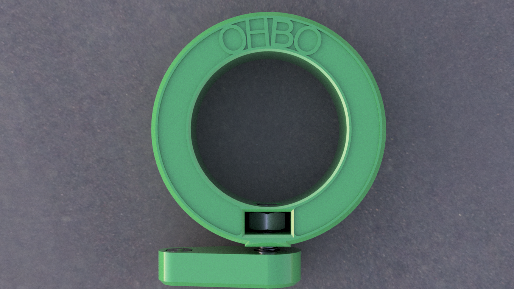
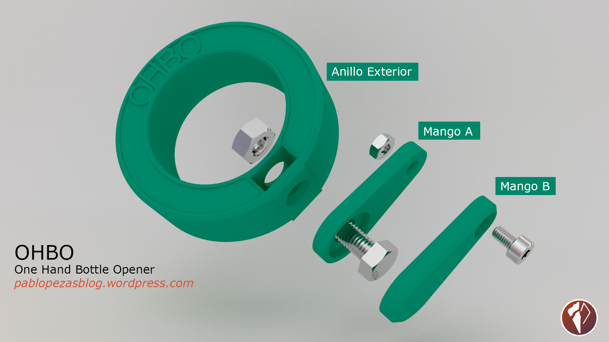
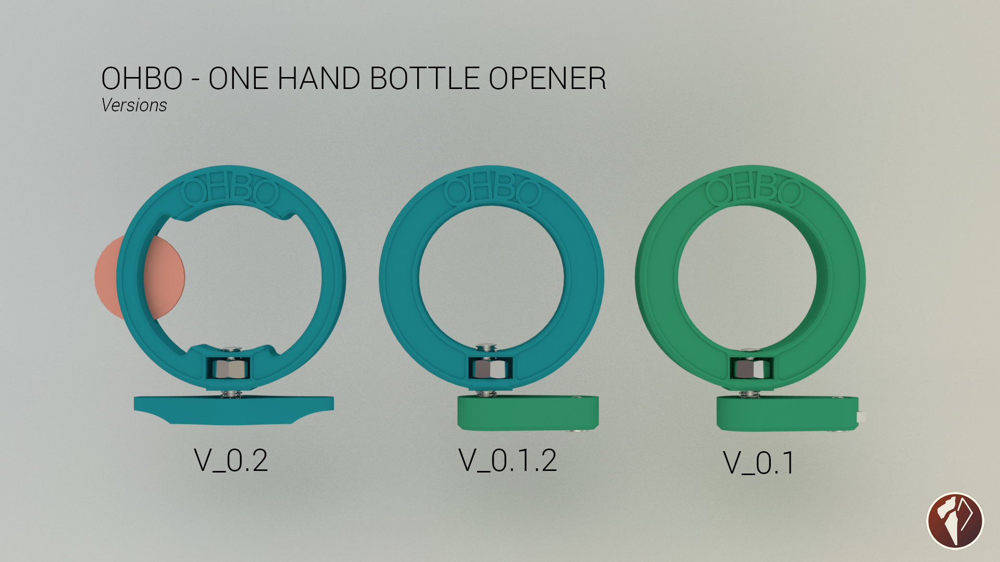

## OHBO-One-Hand-Bottle-Opener

OHBO is a 3D printed low cost tool, designed to allow people with only one hand avaliable, can open a water bottle.

https://hackaday.io/project/13295-ohbo-one-hand-bottle-opener

Other hardware needed:

1 M3x4mm screw (allen is best)
1 M5x20mm screw (allen is best)
1 M3 bolt (0.1 only)
1 M5 bolt (0.1 only)
5 euro cents (0.2 only)

 OHBO - One Hand Bottle Opener by <a xmlns:cc="http://creativecommons.org/ns#" href="https://pablopezasblog.wordpress.com/2016/08/28/ohbo-one-hand-bottle-opener/" property="cc:attributionName" rel="cc:attributionURL">Pablo López (Pablopeza)</a> is licensed under a <a rel="license" href="http://creativecommons.org/licenses/by-nc/4.0/">Creative Commons Reconocimiento-NoComercial 4.0 Internacional License</a>.
